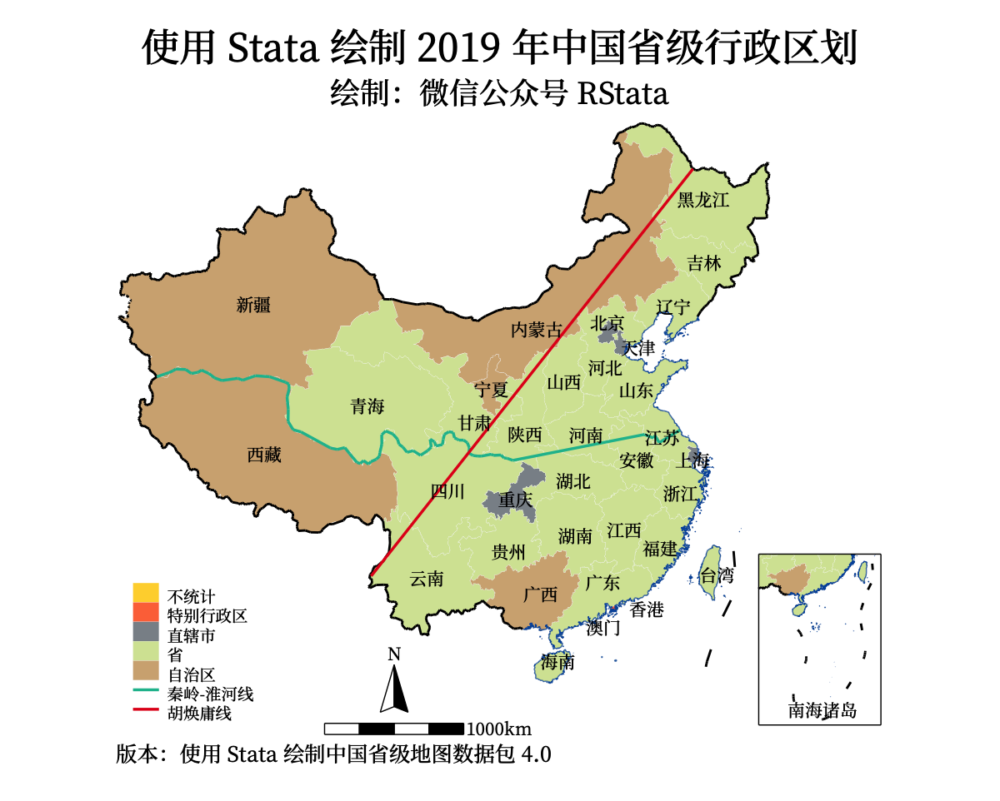
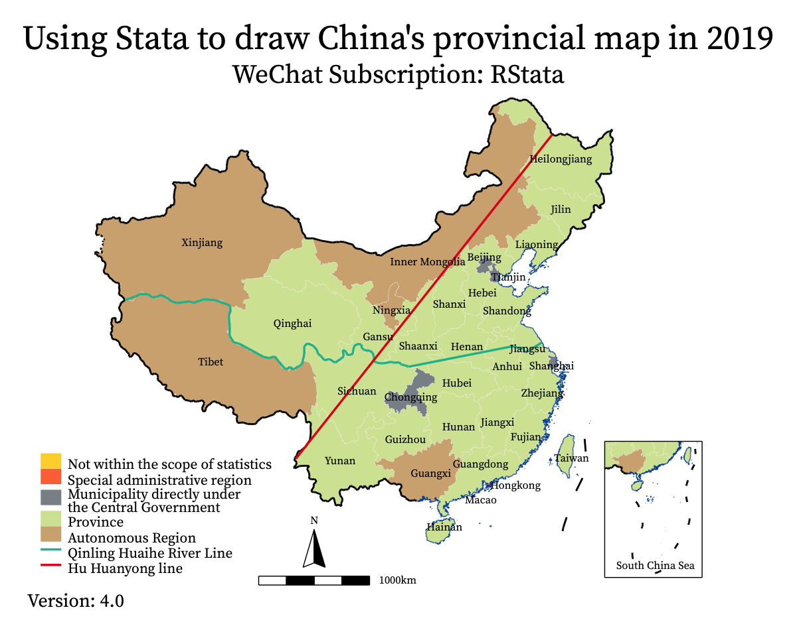
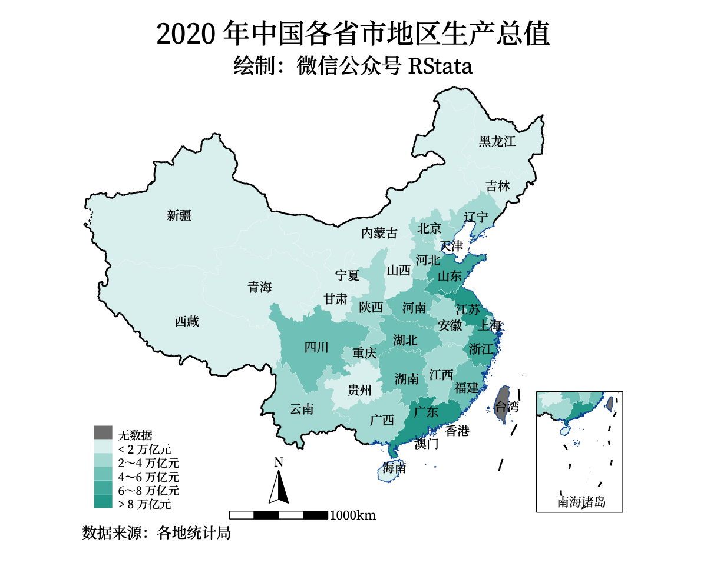
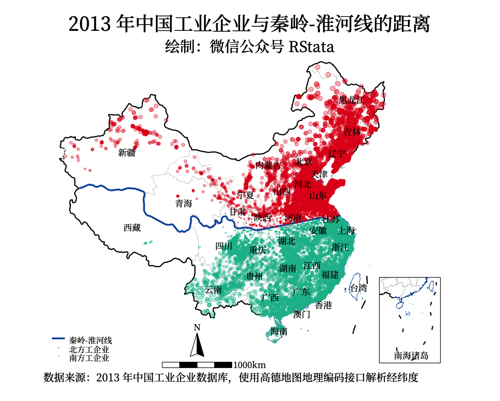
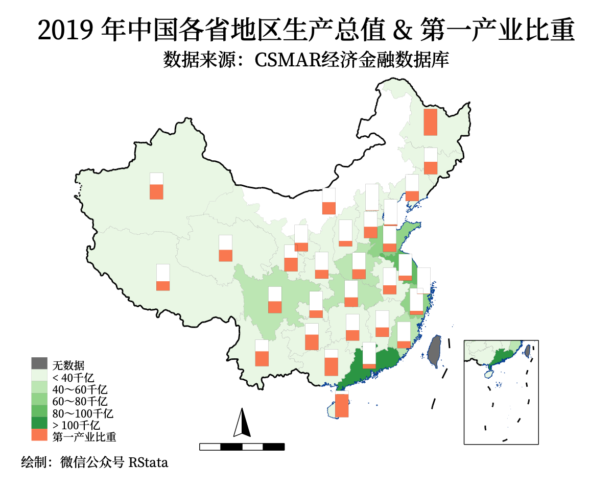
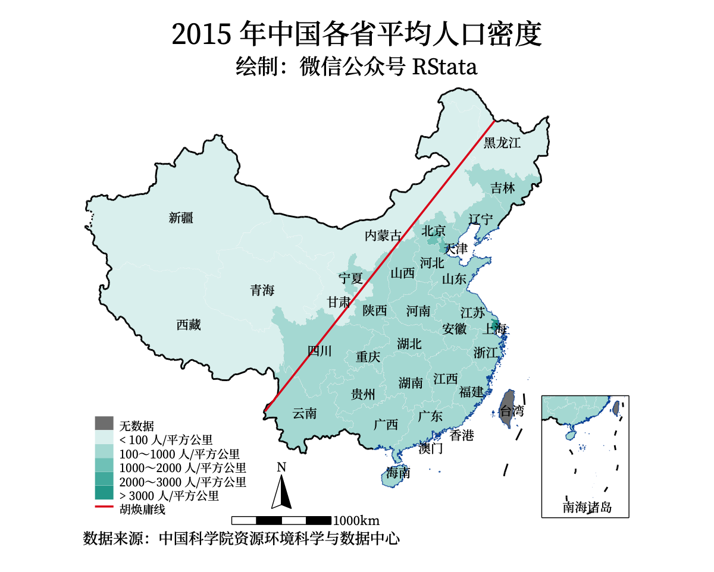
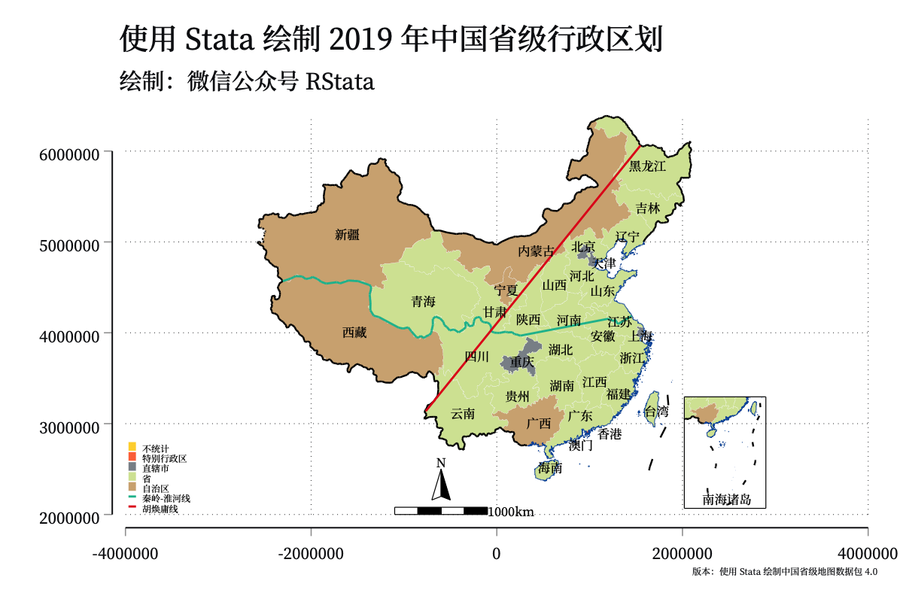
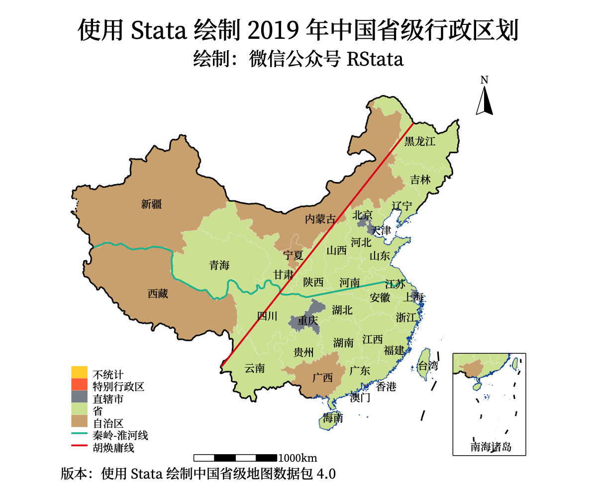
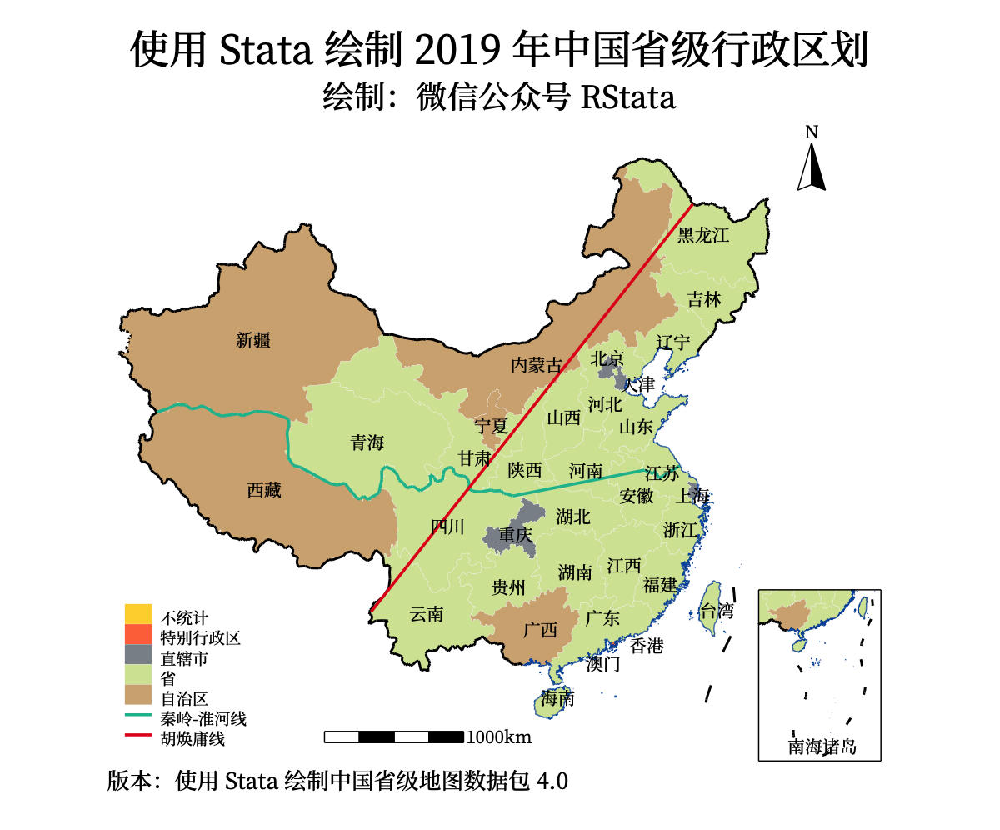

```{r setup, include=FALSE}
knitr::opts_chunk$set(echo = TRUE,
                      dpi = 400,
                      warning = FALSE,
                      message = FALSE,
                      out.width = "100%",
                      out.height = "500px",
                      fig.align = 'center',
                      comment = "#>")
```

根据大家之前的一些反馈，我们又重新设计了一份使用 Stata 绘制省级地图的数据，这次的地图数据比起之前的版本有如下变化：

1. 指北针变得竖直了！
2. 包含了未定国界；
3. 添加了海岸线；
4. 添加了秦岭-淮河线；
5. 添加了胡焕庸线；
6. 添加了英文版本！
7. 比例尺和指北针的位置可以移动了！

为了让大家更好的学习这份地图数据的使用，我们设计了下面的这些案例：

## 2019 年中国省级行政区划

我们首先看一下离散变量的填充地图如何绘制，例如 `chinaprov40_db.dta` 数据里面有个类型变量就是离散变量，我们可以使用 encode 命令生成因子变量用于填充绘图：

```stata
* 离散变量的绘制
use chinaprov40_db.dta, clear 
encode 类型, gen(type)
codebook type

grmap type using chinaprov40_coord.dta, ///
	id(ID) osize(vvthin ...) ocolor(white ...) ///
	clmethod(custom) clbreaks(0 1 2 3 4 5) ///
	fcolor("254 212 57" "253 116 70" "138 145 151" "213 228 162" "210 175 129") ///
	leg(order(2 "不统计" 3 "特别行政区" 4 "直辖市" 5 "省" 6 "自治区" 11 "秦岭-淮河线" 14 "胡焕庸线")) ///
	graphr(margin(medium)) ///
	line(data(chinaprov40_line_coord.dta) by(group) size(vvthin *1 *0.5 *1.2 *0.5 *0.5 *1.2) pattern(solid ...) ///
		color(white /// 省界颜色
			  black /// 国界线颜色
			  "0 85 170" /// 海岸线颜色
			  "24 188 156" /// 秦岭淮河线颜色
			  black /// 小地图框格颜色
			  black /// 比例尺和指北针颜色
			  "227 26 28" /// 胡焕庸线颜色
			  )) ///
	polygon(data(polygon) fcolor(black) ///
		osize(vvthin)) ///
	label(data(chinaprov40_label) x(X) y(Y) label(cname) length(20) size(*0.8)) ///
	ti("使用 Stata 绘制 2019 年中国省级行政区划") ///
	subti("绘制：微信公众号 RStata") ///
	caption("版本：使用 Stata 绘制中国省级地图数据包 4.0", size(*0.8))
gr export pic1.png, replace width(1200)
```



line() 选项里面的 size() 和 color() 子选项分别用了 7 种尺寸和颜色，依照顺序分别对应省界线、国界线、海岸线、秦岭-淮河线、小地图框格、比例尺指北针、胡焕庸线。

> 关于颜色的选择，可以使用这个网站：https://tidyfriday.cn/colors 

## 英文地图

`chinaprov40_label.dta` 数据决定了文本标签的位置和内容，如果想绘制英文版的地图，可以使用 ename 变量：

```stata
grmap type using chinaprov40_coord.dta, ///
	id(ID) osize(vvthin ...) ocolor(white ...) ///
	clmethod(custom) clbreaks(0 1 2 3 4 5) ///
	fcolor("254 212 57" "253 116 70" "138 145 151" "213 228 162" "210 175 129") ///
	leg(order(2 "Not within the scope of statistics" 3 "Special administrative region" 4 "Municipality directly under" "the Central Government" 5 "Province" 6 "Autonomous Region" 11 "Qinling Huaihe River Line" 14 "Hu Huanyong line")) ///
	graphr(margin(medium)) ///
	line(data(chinaprov40_line_coord.dta) by(group) size(vvthin *1 *0.5 *1.2 *0.5 *0.5 *1.2) pattern(solid ...) ///
		color(white /// 省界颜色
			  black /// 国界线颜色
			  "0 85 170" /// 海岸线颜色
			  "24 188 156" /// 秦岭淮河线颜色
			  black /// 小地图框格颜色
			  black /// 比例尺和指北针颜色
			  "227 26 28" /// 胡焕庸线颜色
			  )) ///
	polygon(data(polygon) fcolor(black) ///
		osize(vvthin)) ///
	label(data(chinaprov40_label) x(X) y(Y) label(ename) length(20) size(*0.6)) ///
	ti("Using Stata to draw China's provincial map in 2019") ///
	subti("WeChat Subscription: RStata") ///
	caption("Version: 4.0", size(*0.8))
gr export pic2.png, replace width(1200)
```



## 2020 年中国各省市地区生产总值

连续变量的绘制方法和离散变量的类似，通过恰当的分组和颜色填充就可以绘制出精美的图表了，下面以2020 年中国各省市地区生产总值的填充地图绘制为例：

```stata
import delimited using "2020年中国各省市地区生产总值.csv", clear encoding(utf8)
gen prov = substr(省份, 1, 6)
save 2020年中国各省市地区生产总值, replace 

use chinaprov40_db.dta, clear 
gen prov = substr(省, 1, 6)
merge 1:1 prov using 2020年中国各省市地区生产总值
replace 地区生产总值 = -1 if missing(地区生产总值)
grmap 地区生产总值 using chinaprov40_coord.dta, ///
	id(ID) osize(vvthin ...) ocolor(white ...) ///
	clmethod(custom) clbreaks(-1 0 20000 40000 60000 80000 120000) ///
	fcolor(gray "224 242 241" "178 223 219" "128 203 196" "77 182 172" "38 166 154") ///
	leg(order(2 "无数据" 3 "< 2 万亿元" 4 "2～4 万亿元" 5 "4～6 万亿元" 6 "6～8 万亿元" 7 "> 8 万亿元")) ///
	graphr(margin(medium)) ///
	line(data(chinaprov40_line_coord.dta) ///
		/// 去除秦岭淮河线(4)、胡焕庸线(7)
		select(keep if inlist(group, 1, 2, 3, 5, 6)) ///
		by(group) size(vvthin *1 *0.5 *0.5 *0.5) ///
		pattern(solid ...) ///
		color(white /// 省界颜色
			  black /// 国界线颜色
			  "0 85 170" /// 海岸线颜色
			  black /// 小地图框格颜色
			  black /// 比例尺和指北针颜色
			  )) ///
	polygon(data(polygon) fcolor(black) ///
		osize(vvthin)) ///
	label(data(chinaprov40_label) x(X) y(Y) label(cname) length(20) size(*0.8)) ///
	ti("2020 年中国各省市地区生产总值") ///
	subti("绘制：微信公众号 RStata") ///
	caption("数据来源：各地统计局", size(*0.8))
gr export pic3.png, replace width(1200)
```



## 2013 年中国工企业分布及距离秦岭淮河的距离

除了填充地图外，我们还经常会需要绘制描点地图，也就是在地图上添加坐标点，下面以2013 年中国工企业分布及距离秦岭淮河的距离可视化为例。

由于提供的地图底图数据是经过投影变换的，所以如果大家想把经纬度坐标点描制在底图上，也需要对坐标进行投影变换，为此，我编写了一个网页应用帮助大家进行投影变换：https://czxb.shinyapps.io/crs-trans/

另外如果你有一些 R 语言的使用基础，也可以使用 `坐标转换.R` 进行坐标转换。

```stata
* 转换坐标系
* 转换方式一：https://czxb.shinyapps.io/crs-trans/
* 注意事项，上传的 csv 文件应该包含数值型的 lon 和 lat 变量，观测值上限大概是 10 万个，不可多人同时使用。
use gq2013sample, clear 
keep 经度 纬度
ren 经度 lon
ren 纬度 lat
export delimited using "待转换.csv", replace 

* 转换方式二：使用附件中的 R 脚本转换

* 处理转换后的数据
import delimited using "转换后的数据.csv", clear 
gen id = _n
save 转换后的数据, replace 

use gq2013sample, clear 
gen id = _n
merge 1:1 id using 转换后的数据
drop _m id *度
encode 北方或南方, gen(north)
save pointdata, replace 

use chinaprov40_db.dta, clear
spmap using chinaprov40_coord.dta, id(ID) ///
	ocolor("black" ...) osize(vvthin ...) ///
    line(data(chinaprov40_line_coord.dta) ///
		/// 胡焕庸线（7）
		select(keep if inlist(group, 1, 2, 3, 4, 5, 6)) ///
		by(group) size(vvthin *1 *0.5 *1.5 *0.5 *0.5) ///
		pattern(solid ...) ///
		color(white /// 省界颜色
			  black /// 国界线颜色
			  "0 85 170" /// 海岸线颜色
			  "0 85 170" /// 秦岭淮河线颜色
			  black /// 小地图框格颜色
			  black /// 比例尺和指北针颜色
			  )) ///
	polygon(data(polygon) fcolor(black) ///
		osize(vvthin)) ///
	label(data(chinaprov40_label) x(X) y(Y) label(cname) length(20) size(*0.8)) ///
    point(data(pointdata) by(north) ///
    	fcolor("227 26 28%30" "24 188 156%30") ///
        x(x) y(y) ///
        proportional(与秦岭淮河线的距离) ///
        size(*0.1) legenda(on)) ///
    leg(order(7 "秦岭-淮河线" 10 "北方工企业" 11 "南方工企业")) ///
    ti("2013 年中国工业企业与秦岭-淮河线的距离", color(black)) /// 
    subti("绘制：微信公众号 RStata") ///
    graphr(margin(medium)) ///
    caption("数据来源：2013 年中国工业企业数据库，使用高德地图地理编码接口解析经纬度", size(*0.8))
gr export pic4.png, replace width(1200)
```



## 2019 年中国各省地区生产总值 & 产业结构

也可以绘制地图+饼图，其中饼图的位置可以用标签位置：

```stata
use 各省历年GDP, clear 
drop if 省份 == "中国"

replace 地区生产总值_亿元 = 地区生产总值_亿元 / 1000
merge m:m 省代码 using chinaprov40_db.dta
replace 地区生产总值_亿元 = -1 if missing(年份)
grmap 地区生产总值_亿元 if 年份 == 2019 | missing(年份) ///
	using chinaprov40_coord.dta, id(ID) ///
	clmethod(custom) clbreaks(-1 0 40 60 80 100 120) /// 
	fcolor("gray" "237 248 233" "199 233 192" "161 217 155" "116 196 118" "49 163 84") ///
	ocolor("gray" ...) ///
	ti("2019 年中国各省地区生产总值 & 产业结构", size(*1.1)) ///
	subtitle("数据来源：CSMAR经济金融数据库") ///
	graphr(margin(medium)) ///
	osize(vvthin ...) ///
	legend(size(*1.1) ///
		order(2 "无数据" 3 "< 40千亿" ///
			4 "40～60千亿" 5 "60～80千亿" ///
			6 "80～100千亿" 7 "> 100千亿" ///
			14 "第一产业" 15 "第二产业" 16 "第三产业")) ///
	caption("绘制：微信公众号 RStata", size(*0.8)) ///
	line(data(chinaprov40_line_coord.dta) ///
		/// 去除秦岭淮河线(4) 胡焕庸线（7）
		select(keep if inlist(group, 1, 2, 3, 5, 6)) ///
		by(group) size(vvthin *1 *0.5 *0.5 *0.5) ///
		pattern(solid ...) ///
		color(white /// 省界颜色
			  black /// 国界线颜色
			  "0 85 170" /// 海岸线颜色
			  black /// 小地图框格颜色
			  black /// 比例尺和指北针颜色
			  )) ///
	polygon(data(polygon) fcolor(black) ///
		osize(vvthin)) ///
	label(data(chinaprov40_label) x(X) y(Y) label(cname) length(20) size(*0.8)) ///
	diagram(data(piedata) x(X) y(Y) v(第一产业占GDP比重_百分比 第二产业占GDP比重_百分比 第三产业占GDP比重_百分比) ///
		type(pie) legenda(on) os(vvthin) ///
			size(1.5) fc("102 194 165" "252 141 98" "229 196 148") ///
			oc("102 194 165" "252 141 98" "229 196 148"))

gr export "pic5.png", replace width(1200)
```

另外饼图也可以换成框架矩形图：

```stata
grmap 地区生产总值_亿元 if 年份 == 2019 | missing(年份) ///
	using chinaprov40_coord.dta, id(ID) ///
	clmethod(custom) clbreaks(-1 0 40 60 80 100 120) /// 
	fcolor("gray" "237 248 233" "199 233 192" "161 217 155" "116 196 118" "49 163 84") ///
	ocolor("gray" ...) ///
	ti("2019 年中国各省地区生产总值 & 第一产业比重", size(*1.1)) ///
	subtitle("数据来源：CSMAR经济金融数据库") ///
	graphr(margin(medium)) ///
	osize(vvthin ...) ///
	legend(size(*1.1) ///
		order(2 "无数据" 3 "< 40千亿" ///
			4 "40～60千亿" 5 "60～80千亿" ///
			6 "80～100千亿" 7 "> 100千亿" ///
			15 "第一产业比重")) ///
	caption("绘制：微信公众号 RStata", size(*0.8)) ///
	line(data(chinaprov40_line_coord.dta) ///
		/// 去除秦岭淮河线(4) 胡焕庸线（7）
		select(keep if inlist(group, 1, 2, 3, 5, 6)) ///
		by(group) size(vvthin *1 *0.5 *0.5 *0.5) ///
		pattern(solid ...) ///
		color(white /// 省界颜色
			  black /// 国界线颜色
			  "0 85 170" /// 海岸线颜色
			  black /// 小地图框格颜色
			  black /// 比例尺和指北针颜色
			  )) ///
	polygon(data(polygon) fcolor(black) ///
		osize(vvthin)) ///
	diagram(data(piedata) x(X) y(Y) v(第一产业占GDP比重_百分比) ///
		type(frect) legenda(on) os(vvthin) ///
			size(1.5) fc("252 141 98") ///
			oc("252 141 98") refsize(none))
gr export "pic6.png", replace width(1200)
```



## 各省人口密度

最后我们再演示下胡焕庸线的用法：

```stata
use 中国人口空间分布省级面板数据集.dta, clear 
ren 省份 省
merge m:1 省 using chinaprov40_db.dta
keep if 年份 == 2015 | missing(年份)
replace 均值 = -1 if missing(均值)
grmap 均值 using chinaprov40_coord.dta, ///
	id(ID) osize(vvthin ...) ocolor(white ...) ///
	clmethod(custom) clbreaks(-1 0 100 1000 2000 3000 4000) ///
	fcolor(gray "224 242 241" "178 223 219" "128 203 196" "77 182 172" "38 166 154") ///
	leg(order(2 "无数据" 3 "< 100 人/平方公里" 4 "100～1000 人/平方公里" 5 "1000～2000 人/平方公里" 6 "2000～3000 人/平方公里" 7 "> 3000 人/平方公里" 14 "胡焕庸线")) ///
	graphr(margin(medium)) ///
	line(data(chinaprov40_line_coord.dta) ///
		/// 去除秦岭淮河线(4)
		select(keep if inlist(group, 1, 2, 3, 5, 6, 7)) ///
		by(group) size(vvthin *1 *0.5 *0.5 *0.5 *1.2) ///
		pattern(solid ...) ///
		color(white /// 省界颜色
			  black /// 国界线颜色
			  "0 85 170" /// 海岸线颜色
			  black /// 小地图框格颜色
			  black /// 比例尺和指北针颜色
			  "227 26 28" /// 胡焕庸线颜色
			  )) ///
	polygon(data(polygon) fcolor(black) ///
		osize(vvthin)) ///
	label(data(chinaprov40_label) x(X) y(Y) label(cname) length(20) size(*0.8)) ///
	ti("2015 年中国各省平均人口密度") ///
	subti("绘制：微信公众号 RStata") ///
	caption("数据来源：中国科学院资源环境科学与数据中心", size(*0.8))
gr export pic7.png, replace width(1200)
```



## 调整指北针和比例尺的位置

指北针和比例尺都包括三个部分，line、polygon 和 label，所以我们调整指北针和比例尺的位置也需要修改这三个数据里面的对应坐标，在调整坐标前我们可以给绘图语句加上 freestyle 选项来帮助确定要移动的数值：



然后就可以通过修改数据来调整指北针和比例尺的位置了：

```stata
* 移动指北针的位置到右上方
use chinaprov40_line_db.dta, clear
* 指北针对应的 ID 是 40 和 41
use chinaprov40_line_coord.dta, clear
replace _X = _X + 3000000 if inlist(_ID, 40, 41)
replace _Y = _Y + 4000000 if inlist(_ID, 40, 41)
save chinaprov40_line_coord2.dta, replace 

use polygon, clear
replace _X = _X + 3000000 if _ID == 38
replace _Y = _Y + 4000000 if _ID == 38
save polygon2, replace

use chinaprov40_label, clear
replace X = X + 3000000 if cname == "N"
replace Y = Y + 4000000 if cname == "N"
save chinaprov40_label2, replace 

use chinaprov40_db.dta, clear 
encode 类型, gen(type)
grmap type using chinaprov40_coord.dta, ///
	id(ID) osize(vvthin ...) ocolor(white ...) ///
	clmethod(custom) clbreaks(0 1 2 3 4 5) ///
	fcolor("254 212 57" "253 116 70" "138 145 151" "213 228 162" "210 175 129") ///
	leg(order(2 "不统计" 3 "特别行政区" 4 "直辖市" 5 "省" 6 "自治区" 11 "秦岭-淮河线" 14 "胡焕庸线")) ///
	graphr(margin(medium)) ///
	line(data(chinaprov40_line_coord2.dta) by(group) size(vvthin *1 *0.5 *1.2 *0.5 *0.5 *1.2) pattern(solid ...) ///
		color(white /// 省界颜色
			  black /// 国界线颜色
			  "0 85 170" /// 海岸线颜色
			  "24 188 156" /// 秦岭淮河线颜色
			  black /// 小地图框格颜色
			  black /// 比例尺和指北针颜色
			  "227 26 28" /// 胡焕庸线颜色
			  )) ///
	polygon(data(polygon2) fcolor(black) ///
		osize(vvthin)) ///
	label(data(chinaprov40_label2) x(X) y(Y) label(cname) length(20) size(*0.8)) ///
	ti("使用 Stata 绘制 2019 年中国省级行政区划") ///
	subti("绘制：微信公众号 RStata") ///
	caption("版本：使用 Stata 绘制中国省级地图数据包 4.0", size(*0.8))
gr export pic8.png, replace width(1200)
```



```stata
* 调节比例尺的位置（微微上移）
use chinaprov40_line_db.dta, clear
* 比例尺对应的 ID 是 42 和 43
use chinaprov40_line_coord2.dta, clear
replace _Y = _Y + 200000 if inlist(_ID, 42, 43)
save chinaprov40_line_coord3.dta, replace 

use polygon2, clear
replace _Y = _Y + 200000 if _ID == 39
save polygon3, replace

use chinaprov40_label2, clear
replace Y = Y + 200000 if cname == "1000km"
save chinaprov40_label3, replace 

use chinaprov40_db.dta, clear 
encode 类型, gen(type)
grmap type using chinaprov40_coord.dta, ///
	id(ID) osize(vvthin ...) ocolor(white ...) ///
	clmethod(custom) clbreaks(0 1 2 3 4 5) ///
	fcolor("254 212 57" "253 116 70" "138 145 151" "213 228 162" "210 175 129") ///
	leg(order(2 "不统计" 3 "特别行政区" 4 "直辖市" 5 "省" 6 "自治区" 11 "秦岭-淮河线" 14 "胡焕庸线")) ///
	graphr(margin(medium)) ///
	line(data(chinaprov40_line_coord3.dta) by(group) size(vvthin *1 *0.5 *1.2 *0.5 *0.5 *1.2) pattern(solid ...) ///
		color(white /// 省界颜色
			  black /// 国界线颜色
			  "0 85 170" /// 海岸线颜色
			  "24 188 156" /// 秦岭淮河线颜色
			  black /// 小地图框格颜色
			  black /// 比例尺和指北针颜色
			  "227 26 28" /// 胡焕庸线颜色
			  )) ///
	polygon(data(polygon3) fcolor(black) ///
		osize(vvthin)) ///
	label(data(chinaprov40_label3) x(X) y(Y) label(cname) length(20) size(*0.8)) ///
	ti("使用 Stata 绘制 2019 年中国省级行政区划") ///
	subti("绘制：微信公众号 RStata") ///
	caption("版本：使用 Stata 绘制中国省级地图数据包 4.0", size(*0.8))
gr export pic9.png, replace width(1200)
```



---

<h5 align="center">©微信公众号 RStata</h5>
